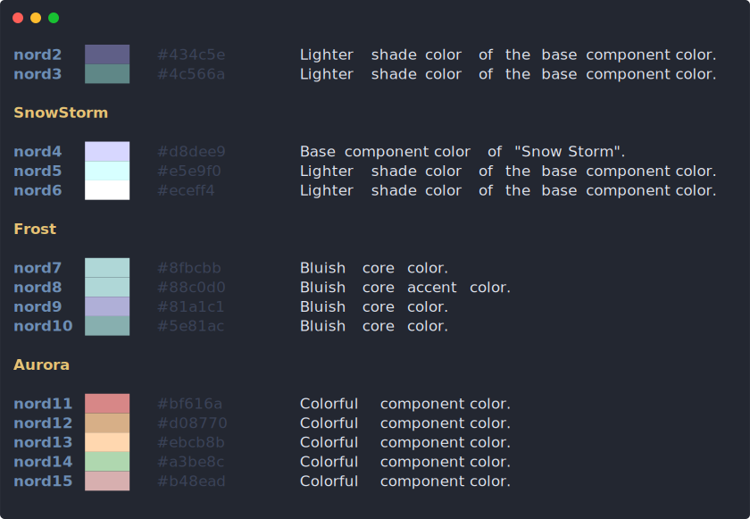

# Palette

<a href="https://www.npmjs.com/package/nord"></a>

I love the [Nord color scheme][nord] and use it in [various projects](http://www.xav-b.fr).

Unfortunately it usually involves opening in the browser a visual + the
css/sass sources to get the actual hex code.

This package integrates this workflow in the terminal.

`npm install -g palette-cli && palette --help`


## Usage

```bash
palette ls nord
```

<p align="center"> 
  <br><br><br>
  
  <br><br><br>
</p>

```bash
# copy hex code to clipboard
palette cp nord8

# read more online about the color palette
open $(palette doc nord)
```

---

### TODO

- [ ] [Write it in Typescript](https://github.com/Microsoft/TypeScript-Node-Starter)
- [ ] Publish with [np](https://github.com/sindresorhus/np)
- [ ] Implement [Ayu](https://github.com/ayu-theme/ayu-colors)
- [x] Copy hex code to clipboard


---

<p align="center">Copyright &copy; 2018-present Xavier Bruhiere</p>

<p align="center"><a href="https://github.com/xav-b/palette/blob/develop/LICENSE"></a> <a href="https://creativecommons.org/licenses/by-sa/4.0"></a></p>


[nord]: https://arcticicestudio.github.io/nord/
